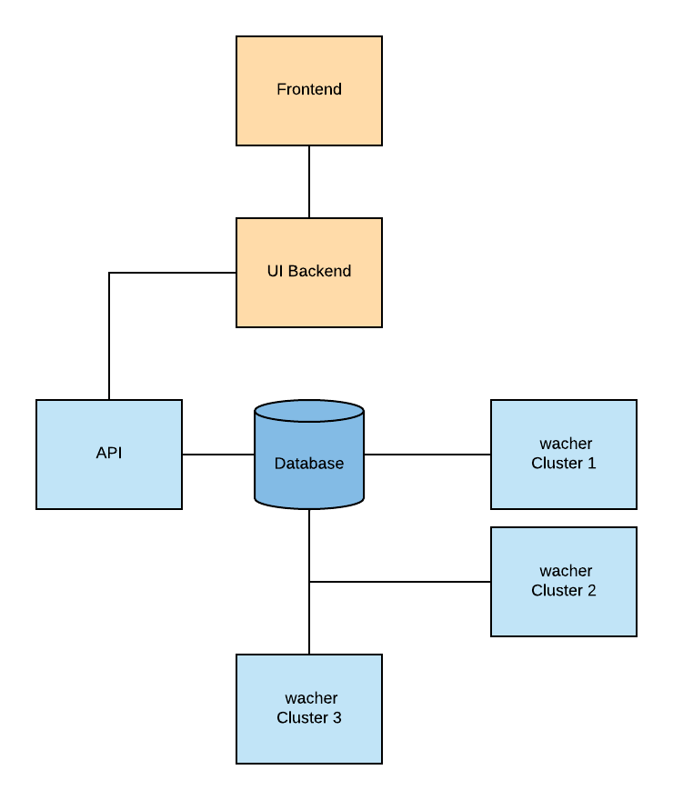

# Working with Multiple Clusters

There are two approaches when working with multiple clusters:
1. Initialize StatusBay application per cluster
2. Launch a centralized StatusBay application instance and multiple watchers pushing events to the same stream.

In this readme file we'll focus on the second approach as the first one is just as simple as [installing a single application]() multiple times.

## Working with multiple clusters
1. If you haven't launched one already, [start the first instance of your StatusBay application](https://github.com/similarweb/statusbay-helm) on your root cluster.
2. Make sure all your K8S clusters have access to the main Database.
3. Deploy StatusBay with "watcher-only" configuration enabled on the secondary cluster. Read more about deploying watcher-only configuration [here](https://github.com/similarweb/statusbay-helm/blob/master/watcher.yaml.example).
4. Repeat steps 2 & 3 on all other clusters.
