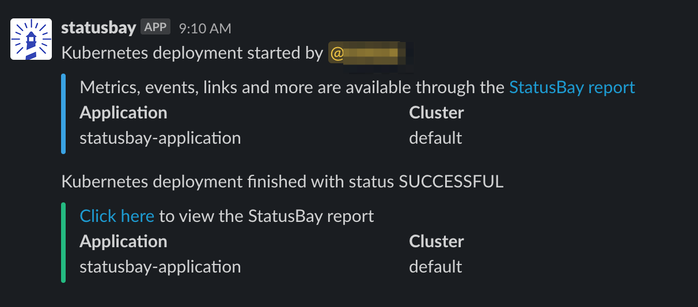

# Slack
This integration makes the following assumptions: 

* You have an active account in Slack
* You have a dedicated Bot and Token for StatusBay to use Slack's API.
  
StatusBay introduces the ability to send Slack notifications for a specific Deployment,Daemonset & Statefulset operations (Create/Update/Delete) on Kubernetes. 

On operator of a Deployment,Daemonset & Statefulset in Kubernetes will have ability to send slack notifications to a User or a channel,

## How to enable this provider?

In order to enable this provider please proceed with the next steps:

* Configure Pingdom provider via StatusBay [API configuration file](../../../examples/configuration/api.yaml#L25), you will find all the available configuration options in the example file.
* Add the [Available annotations](#available-annotations) for this provider

## Available annotations
| Name | Type | Associated Annotations | 
| ---- | ---- | ---------------------- | 
| Slack | Notifications | `statusbay.io/report-slack-channels: #channel1,#channel2` |
| Slack | Notifications | `statusbay.io/report-deploy-by: foo@similarweb.com` |

* Make sure you add these annotations to one of the following kinds: Deployment,Daemonset & Statefulset.
* The `report-slack-channels` annotation supports comma separated list of Slack channels which we want to be notified. 

    :heavy_exclamation_mark: Please make sure that you invite the new StatusBay slack bot to all the relevant channels you have added in your annotation, The bot will not be able to send slack messages to channels where is not present.

* The `report-deploy-by` annotation addresses the user which will be sent with a slack notification for a deployment which has started/finished.

## The result

